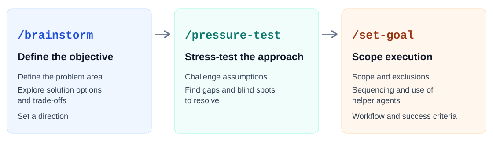

# Agent skills

Three skills I use to work through ambiguous questions with AI: **develop options, challenge a decision, and define the work before execution.**

I built these as part of my personal Claude Code and Codex workspace. They help me make the reasoning explicit: read the relevant sources, compare concrete alternatives, examine assumptions and decide what to do. I retain responsibility for the judgement and the final call.

This is a small, standalone selection from that workspace. You can read the methods below or install the skills and use them with your own work.



**Start where you are.** Each skill works on its own. The handoffs are optional.

## Choose a skill

| Your situation | Skill | What you get |
|---|---|---|
| “I need credible alternatives.” | [brainstorm](skills/brainstorm/SKILL.md) | Concrete options with examples, trade-offs and a recommendation, refined until you choose a direction. |
| “I have a proposal. What am I missing?” | [pressure-test](skills/pressure-test/SKILL.md) | Evidence, challenged assumptions and questions in dependency order, with unresolved choices kept visible. |
| “I know the direction. Define the task.” | [set-goal](skills/set-goal/SKILL.md) | An explicit goal, observable success criteria, boundaries and an execution approach for your review. |

## An example: improve a weekly operating review

*Illustrative scenario and outputs, not a transcript or a claim about achieved results.* Twelve people attend a weekly hour-long meeting. Updates fill the agenda, while cross-functional decisions remain unresolved.

| Skill | What the exchange could produce |
|---|---|
| **brainstorm** | Compare a 25-minute exception review, asynchronous updates plus a decision meeting, and alternating operating/deep-dive weeks. Show an agenda for each and explain what each gives up. |
| **pressure-test** | Examine whether meeting format is the problem or whether the team has never defined which decisions the forum owns. Settle that before deciding who attends. |
| **set-goal** | After you choose a direction, draft a two-week pilot brief. Proposed checks could include a recorded owner for each decision and an explicit follow-up for unresolved items. |

Your intervention might be: **keep a live forum for resource conflicts; move status updates into the pre-read.** That choice changes the next proposal. The AI develops and examines the options; you supply context and decide.

## How the skills work

- **Read before asking.** Use available sources to answer factual questions; ask you for decisions that require your judgement.
- **Use independent perspectives where they help.** Brainstorm can ask a fresh helper to develop another approach. Pressure-test can ask a fresh critic to examine a consequential proposal. Both depend on the tools available in your session.
- **Follow dependencies.** Resolve a question before asking you to decide something that depends on its answer.
- **Keep the decision with you.** Iterate on your feedback and preserve what you have already settled.

[The patterns document](docs/agentic-patterns.md) shows these mechanisms, their trade-offs and where they appear in the instructions. These are instructions for an agent, not a separate workflow engine. `set-goal` prepares a brief; it does not start an autonomous loop or execute the task.

## Install and use

You need Claude Code or Codex with skill support. The package contains Markdown skills and metadata, with no hooks, scripts, connectors or background processes. Each skill is explicitly invoked. Exploration and scoping stay in the conversation unless you separately request saved output or execution.

### Claude Code

In a Claude Code session:

```text
/plugin marketplace add keniba/agent-skills
/plugin install agent-skills@agent-skills
```

Start a fresh session, then choose one:

```text
/agent-skills:brainstorm Our weekly operating review isn't helping us make decisions. Develop alternatives.
/agent-skills:pressure-test We're considering replacing the review with asynchronous updates. Examine the proposal.
/agent-skills:set-goal Scope a two-week pilot with asynchronous updates and a live meeting for resource conflicts.
```

### Codex

In your terminal:

```sh
codex plugin marketplace add keniba/agent-skills
codex plugin add agent-skills@agent-skills
```

Start a fresh Codex session. Select the installed skill from the skill picker, or invoke it explicitly:

```text
$agent-skills:brainstorm Our weekly operating review isn't helping us make decisions. Develop alternatives.
$agent-skills:pressure-test We're considering replacing the review with asynchronous updates. Examine the proposal.
$agent-skills:set-goal Scope a two-week pilot with asynchronous updates and a live meeting for resource conflicts.
```

If you already have skills with these names, select the ones supplied by **agent-skills**. The three lines above are independent examples, not a required sequence.

### Compatibility

Both tools use the same skill instructions. Host-specific metadata controls invocation; helper agents, structured questions and permissions depend on the host. When helpers are unavailable, the skill continues in one context and states that independent generation or review was not performed.

Checked locally on 23 September 2026 with **Claude Code 2.1.261** and **Codex CLI 0.153.4**: package loading, fresh-session discovery and a fictional scenario for each skill. Codex was installed from a local marketplace; Claude used a local plugin directory. These are bounded smoke checks, not an exhaustive evaluation of judgement quality. Installation from GitHub remains to be checked at publication.

## Credit and licence

`pressure-test` adapts ideas from [Matt Pocock's skills](https://github.com/mattpocock/skills), particularly the grilling approach to decision trees and dependent questions. [Superpowers' brainstorming skill](https://github.com/obra/superpowers/tree/main/skills/brainstorming) informed the development of `brainstorm`.

The collection is available under the [MIT licence](LICENSE). [Attribution and upstream notices](NOTICE.md) distinguish those influences. Adapt the methods to your own work.
