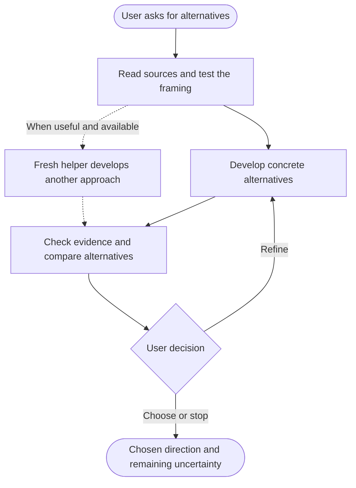
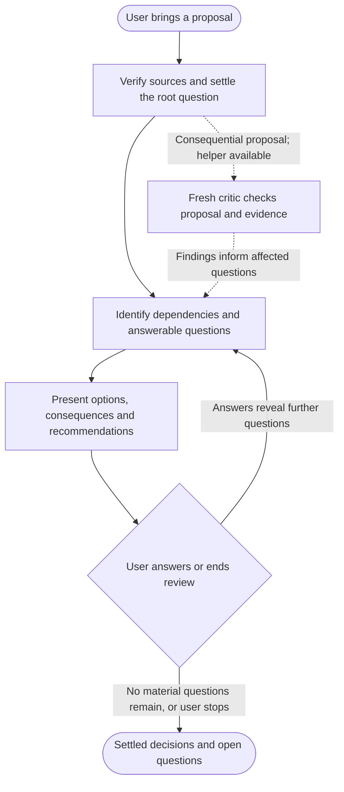
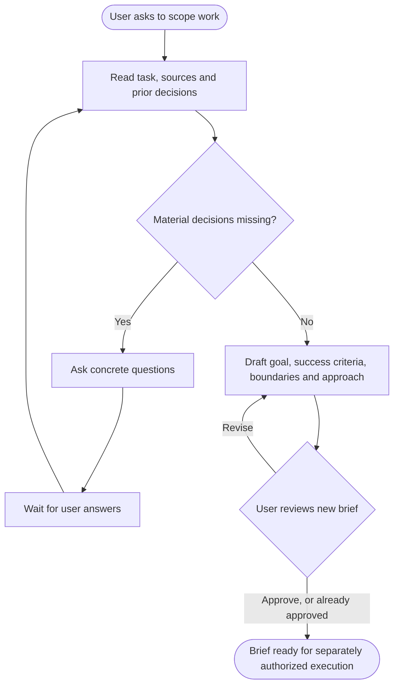

# Patterns in the skills

The three skills make recurring judgement work explicit. They combine source gathering, model reasoning and human decisions, with independent helpers when those would improve the work.

The diagrams below describe the intended interaction. They are not executable graphs or guarantees that a model follows every instruction. Claude Code or Codex supplies tool execution, context, permissions and any helper-agent capability.

## The common design

| Mechanism | Where it appears | What it buys / costs |
|---|---|---|
| Source-grounded reasoning | All three read relevant material before asking questions or making proposals. | Fewer questions the evidence already answers; source access and quality still limit the result. |
| Independent generation | Brainstorm asks a fresh helper for a distinct approach when alternatives justify it. | Reduces anchoring on one proposal; adds work and does not guarantee diversity. |
| Independent critique | Pressure-test can give a fresh critic the proposal and evidence without the author's persuasive discussion. | A separate chance to find a consequential error; the main agent must verify findings. |
| Dependency-ordered questions | Pressure-test resolves upstream choices before asking dependent questions. | Avoids answering questions on assumptions that may change; requires keeping unresolved questions visible. |
| Feedback and human decisions | The user chooses options, resolves trade-offs and approves the brief. | Preserves judgement and context; the process needs the user's participation. |
| Planning an execution method | Set-goal chooses an approach, success checks and a stopping condition for subsequent work. | Makes the task explicit; planning alone does not establish execution or success. |

## Brainstorm: generate, compare, refine

[Read the instructions](../skills/brainstorm/SKILL.md).

The skill first checks the sources and the question's framing. It then develops materially different alternatives, with actual examples and trade-offs. For substantial alternatives, a fresh helper develops another approach without seeing the main agent's preferred answer. The main agent checks and integrates the results; the user chooses or redirects the next round.

**Pattern:** independent generation and comparison, with human selection and a feedback loop. A helper working alongside the main agent adds parallel work. A single agent producing several options is not independent generation, and this skill does not require a tournament or model judge.

**Design reason:** the first plausible idea can narrow the conversation too early. Concrete alternatives make the consequences of choosing visible.

## Pressure-test: examine decisions in dependency order

[Read the instructions](../skills/pressure-test/SKILL.md).

The skill tests whether the proposal addresses the right question, then maps the choices beneath it. It asks the material questions that can be answered now and carries unresolved questions into later rounds. A fresh critic or fact-finding helper can run while the main agent continues independent work.

**Pattern:** model-directed evidence gathering, conditional independent critique and human decision rounds. The decision tree organizes dependencies in the reasoning. It is distinct from an executable graph. Testing the problem's framing is also distinct from routing; routing occurs when the skill recommends a different method.

**Design reason:** answering three visible questions can create a false sense of closure while their dependent decisions remain unresolved. The list of open questions prevents those decisions from disappearing when the discussion moves on.

One critic pass is review. An evaluator–optimizer loop additionally requires revision in response to feedback and another evaluation. Do not describe every pressure-test invocation as that loop.

## Set-goal: clarify the task and hand off a brief

[Read the instructions](../skills/set-goal/SKILL.md).

The skill separates settled facts and routine defaults from choices that change the task. It asks for missing decisions before drafting dependent scope. When the task is clear, it drafts the goal, success criteria, boundaries and execution approach for review.

**Pattern:** clarification and human acceptance of an explicit plan. The proposed execution approach might use parallel research, an independent checker or iterative passes. Set-goal does not start those activities, create native goal state or schedule work.

**Design reason:** approval of a broad task can conceal different expectations about its output. An observable success test and clear boundary make that difference visible before execution.

## Trigger, delegation and stopping

All three skills start with an explicit user invocation and operate through conversation. They do not install timers, event listeners or persistent agents. A user can run any one from a cold start; their handoffs are suggestions.

Delegation is conditional. When available, the main agent decides what evidence or alternative would benefit from a separate context and supplies a bounded assignment. This can resemble an orchestrator–workers pattern when the task breakdown is chosen at runtime. Parallelism describes work happening concurrently; orchestration describes its allocation. Neither follows merely from having several headings or steps in a prompt.

Brainstorm stops when the user chooses or ends the exploration. Pressure-test stops when material questions are resolved or the user ends the review. Set-goal ends with an accepted brief. Explicit authorization for subsequent execution remains separate from these stopping points.

## Sources

- [Anthropic: Building effective agents](https://www.anthropic.com/engineering/building-effective-agents) supplies the distinctions among predefined workflows, model-directed agents, parallelization, orchestration and evaluator–optimizer loops. The mappings above are interpretations of these specific skills, not claims that this package implements every pattern in the article.
- [OpenAI: Build skills](https://learn.chatgpt.com/docs/build-skills) describes the skill format, discovery and invocation policy.
- [Claude Code: Extend Claude with skills](https://code.claude.com/docs/en/skills) describes skill invocation and supported host mechanisms.
- [Attribution](../NOTICE.md) identifies the upstream skill influences. The descriptions and diagrams here explain this collection's current methods.
